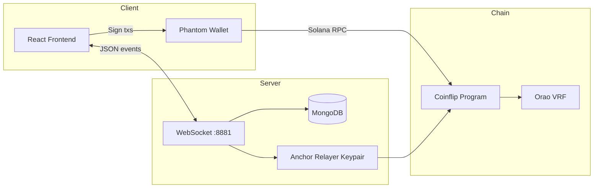

# Solana Coinflip Casino

A full-stack, peer-to-peer **coinflip betting game** on Solana. Players connect a wallet, create or join on-chain game rooms, and compete head-to-head for **2× the stake**. The UI updates in real time over WebSockets, outcomes are resolved on-chain with **Orao VRF**, and the backend tracks rooms, chat, and match history in MongoDB.

<p align="center">
  
  
  
  
</p>

---

## Table of contents

- [Overview](#overview)
- [Features](#features)
- [How it works](#how-it-works)
- [Architecture](#architecture)
- [Repository structure](#repository-structure)
- [Prerequisites](#prerequisites)
- [Getting started](#getting-started)
- [Configuration](#configuration)
- [WebSocket API](#websocket-api)
- [Supported tokens](#supported-tokens)
- [Smart contracts](#smart-contracts)
- [Security and fairness](#security-and-fairness)
- [Deployment notes](#deployment-notes)
- [Roadmap](#roadmap)
- [Contact](#contact)
- [License](#license)

---

## Overview

This project is a **multiplayer Solana casino coinflip** application split into three packages:

| Package | Role |
|--------|------|
| **coinflip-frontend** | React UI — wallet connect, create/join rooms, live lobby, chat |
| **coinflip-backend** | Node.js WebSocket server — room orchestration, tx relay, MongoDB, VRF game handling |
| **coinflip-smart-contract** | Anchor/Rust programs — on-chain game logic (see [Smart contracts](#smart-contracts)) |

The **production PvP program** used by the frontend and backend is deployed at:

`472RXUv8zUX7zm4LprxNsFQvAZYEpSGaY9EUE4akCvG6`

---

## Features

### Gameplay

- **Create a room** — Pick Head or Tail, set bet amount, choose SOL or SPL token.
- **Join a room** — Browse open games in the live lobby and match against another player.
- **PvP coinflip** — When two players are in the same room, the backend triggers on-chain resolution.
- **2× payout** — The winner receives double the bet (fees apply on-chain).
- **Room expiration** — Open rooms older than **5 minutes** with no opponent are expired and refunded automatically.
- **Portfolio stats** — Win count and total games per wallet.

### Platform

- **Real-time lobby** — WebSocket broadcasts for new rooms, joins, results, and expirations.
- **Global chat** — Wallet-linked messages with pagination.
- **Phantom wallet** — Connect via `@solana/wallet-adapter`.
- **Multiple currencies** — SOL, USDT, USDC, BONK (configurable in backend constants).
- **Optional Twitter posts** — Match results can be tweeted after settlement (configure credentials).


### Related Projects

- [Project hub](https://www.flip.is/)


### Demo

[](https://youtu.be/B0pLXF-sOuo)

---

## How it works

### Player flow

1. **Connect wallet** (Phantom) on the frontend.
2. **Create game** — Choose side (Head/Tail), amount, and token; sign the `createGame` transaction.
3. **Another player joins** — They sign `joinOpposite` with the same stake.
4. **Settlement** — The backend calls `handleGame` using Orao VRF; the coin result is written on-chain.
5. **Winner paid** — Funds move per program rules; the UI shows the result and confetti on win.

### Expiration

If nobody joins within **5 minutes**, the backend:

- Refunds the creator (and opponent if partially joined).
- Removes the room from MongoDB.
- Broadcasts `EXPIRE_GAME` to all connected clients.

---

## Architecture



**Data flow (simplified):**

1. Frontend opens WebSocket to backend (`WS_HOST`).
2. `CREATE_ROOM` → backend builds unsigned tx → user signs → `MANAGE_GAMEDATA` (`create`) → backend submits and saves room.
3. `JOIN_ROOM` → second user signs → `MANAGE_GAMEDATA` (`join`) → backend runs `handleGame` → `UPDATE_RESULT` broadcast.

---

## Repository structure

```
Solana-Casino-Coinflip-Game/
├── coinflip-frontend/          # React + Tailwind + wallet adapter
│   ├── src/
│   │   ├── Component/          # UI (Coinflip, Modals, Header, chat)
│   │   ├── Context/            # WebSocket + effects providers
│   │   └── config/             # RPC, program IDs, menu tokens
│   └── package.json
│
├── coinflip-backend/           # WebSocket server + MongoDB
│   ├── controller/             # Anchor txs, refunds, Twitter
│   ├── model/                  # Game & message schemas
│   ├── config/                 # DB connection
│   ├── constant/               # Program ID, seeds, token list
│   ├── index.ts                # WebSocket entry (port 8881)
│   └── package.json
│
├── coinflip-smart-contract/    # Anchor workspace
│   └── coinflip/
│       ├── programs/coinflip/  # Rust program (solo-style reference)
│       ├── tests/
│       └── cli/
│
└── readme.md                   # This file
```

---

## Prerequisites

Install before running locally:

| Tool | Version (recommended) |
|------|------------------------|
| [Node.js](https://nodejs.org/) | 18+ |
| [Yarn](https://yarnpkg.com/) or npm | Latest |
| [MongoDB](https://www.mongodb.com/) | Atlas or local instance |
| [Rust](https://rustup.rs/) | Latest (for smart contract work) |
| [Solana CLI](https://docs.solana.com/cli) | 1.18+ |
| [Anchor](https://www.anchor-lang.com/) | 0.26+ (for contract development) |

You also need:

- A Solana wallet with **devnet SOL** for testing.
- A **backend relayer** keypair (`PRIVATE_KEY`) funded on the same cluster as your RPC.
- The **Anchor IDL** file `coinflip.ts` in `coinflip-backend/` (see [Configuration](#configuration)).

---

## Getting started

Run all three services for local development.

### 1. MongoDB

Create a MongoDB database (local or [MongoDB Atlas](https://www.mongodb.com/atlas)). Note the connection credentials for `.env`.

### 2. Backend

```bash
cd coinflip-backend
yarn install
```

Create `coinflip-backend/.env` (see [Configuration](#configuration)).

Place the program IDL at `coinflip-backend/coinflip.ts` (TypeScript export of the deployed program’s IDL). This file is gitignored; generate it from your deployed Anchor program or copy from your build artifacts.

```bash
yarn dev
# or: yarn start   (nodemon)
```

The WebSocket server listens on **port 8881**.

### 3. Frontend

```bash
cd coinflip-frontend
yarn install
```

Edit `coinflip-frontend/src/config/constant.ts`:

- Set `WS_HOST` to `ws://localhost:8881` for local backend.
- Set `RPC` to your Solana cluster URL (default: devnet).

```bash
yarn start
```

Open [http://localhost:3000](http://localhost:3000).

### 4. Smart contract (optional)

The `coinflip-smart-contract` folder contains an Anchor program useful for learning and testing. The **live PvP game** uses the deployed program ID above; rebuilding requires aligning program ID, IDL, and frontend/backend constants.

```bash
cd coinflip-smart-contract/coinflip
yarn install
anchor build
anchor test
```

---

## Configuration

### Backend environment (`coinflip-backend/.env`)

| Variable | Description |
|----------|-------------|
| `RPC` | Solana RPC URL (e.g. `https://api.devnet.solana.com`) |
| `PRIVATE_KEY` | Base58-encoded secret key for the relayer wallet |
| `FEE_RECEIVER` | Public key that receives platform fees |
| `DB_USERNAME` | MongoDB username |
| `DB_PASSWORD` | MongoDB password |
| `DB_HOST` | MongoDB cluster host |
| `DB_NAME` | Database name |
| `PORT` | Optional HTTP port (default `9000`; WebSocket uses **8881** in code) |

**Example:**

```env
RPC=https://api.devnet.solana.com
PRIVATE_KEY=your_base58_secret_key
FEE_RECEIVER=YourFeeReceiverPublicKey
DB_USERNAME=your_user
DB_PASSWORD=your_password
DB_HOST=cluster0.xxxxx.mongodb.net
DB_NAME=coinflip
```

### Frontend (`coinflip-frontend/src/config/constant.ts`)

| Constant | Purpose |
|----------|---------|
| `COINFLIP` | On-chain program public key |
| `WS_HOST` | WebSocket URL (`ws://localhost:8881` locally) |
| `RPC` | Solana JSON-RPC endpoint |
| `FEE_RECEIVER` / `treasury` | Fee and treasury accounts |

### IDL file

`coinflip-backend` imports the program IDL from `../coinflip` (`coinflip.ts`). That file is listed in `.gitignore`. Without it, the backend will not compile. After deploying or updating the contract, regenerate:

```bash
anchor idl parse -f target/idl/coinflip.json -o coinflip.ts
```

Copy the output into `coinflip-backend/coinflip.ts`.

---

## WebSocket API

Connect to `WS_HOST` (default `ws://localhost:8881`). Messages are JSON: `{ "type": "<EVENT>", ... }`.

### Client → server

| Type | Description |
|------|-------------|
| `CREATE_ROOM` | Build create-game tx (`unit`, `mint`, `decimal`, `amount`, `creator`, `selection`) |
| `JOIN_ROOM` | Build join tx (`unit`, `opposite`, `creator_key`, `mint`, `index`, `amount`) |
| `GET_ROOMS` | List active rooms (last 5 minutes) |
| `MANAGE_GAMEDATA` | `event: "create"` or `"join"` — submit signed txs after wallet approval |
| `Fetch_Result` | Stats for a wallet address |
| `MESSAGE` | Send chat message |
| `FETCH_MESSAGE` | Paginated chat history (`page`) |

### Server → client

| Type | Description |
|------|-------------|
| `ROOM_CREATED` | Unsigned create tx (base64) + room metadata |
| `USER_JOINED` | Unsigned join tx + `gamePDA` |
| `ROOM_LIST` | Active rooms array |
| `ADD_NEW` | New room broadcast |
| `UPDATE_JOIN` | Opponent joined |
| `CHANGE_PROCESS` | Tx processing state |
| `UPDATE_RESULT` | Game finished with result |
| `EXPIRE_GAME` | Room expired / refunded |
| `FETCH_INFO` | `{ win, games }` for wallet |
| `MESSAGE_LIST` | Chat messages |
| `ERROR_HANDLE` | Error string for UI toasts |

---

## Supported tokens

Default list in `coinflip-backend/constant/index.ts`:

| Symbol | Type | Notes |
|--------|------|--------|
| SOL | Native | 9 decimals |
| USDT | SPL | Mainnet mint in config |
| USDC | SPL | Custom mint in repo config |
| BONK | SPL | Custom mint in repo config |

Update mint addresses and decimals for your target network (devnet vs mainnet).

---

## Smart contracts

This repo includes **two related but distinct** on-chain setups:

### 1. Deployed PvP program (used by app)

- **Program ID:** `472RXUv8zUX7zm4LprxNsFQvAZYEpSGaY9EUE4akCvG6`
- **Instructions:** `initialize`, `createGame`, `joinOpposite`, `handleGame`, refunds, etc.
- **Randomness:** [Orao Solana VRF](https://github.com/orao-network/solana-vrf) (`@orao-network/solana-vrf`)
- **Seeds:** `coinflip_global_main`, `coinflip_game`

The backend drives game creation, joins, and settlement via this program’s IDL.

### 2. Anchor program in `coinflip-smart-contract/`

- **Program ID (local):** `7ttfENVhNwb21KjZiLHgXLsX2sC1rKoJgnTVL4wb54t1`
- **Model:** Single-player pool (`play_game`, `claim_reward`) with slot/timestamp-based randomness
- **Use:** Reference implementation, tests, and CLI scripts — not wired to the live PvP UI without redeploying and updating IDs

When extending the project, treat the **deployed PvP program + IDL** as the source of truth for production behavior.

---

## Security and fairness

### Provably fair (PvP matches)

Multiplayer resolution uses **Orao VRF**:

- A unique randomness account per game PDA
- Verifiable, on-chain random outcomes
- Transparent settlement in the coinflip program

### Escrow and funds

- Stakes are locked in program-derived accounts during a match
- The relayer wallet only signs protocol actions configured in the program (e.g. `handleGame`)
- Expired rooms trigger backend-initiated refunds


## FAQ

### Is this financial advice?

No. This project is for educational purposes only. Use at your own risk.

### Can I fork and modify this?

Yes. MIT licensed — fork, modify, and contribute via pull requests.

### Important disclaimers

- **Not audited in this README** — Conduct a professional audit before mainnet use with real funds.
- **Devnet by default** — Frontend `RPC` points to devnet; switch deliberately for production.
- **Secrets** — Never commit `.env`, `PRIVATE_KEY`, or API keys. Move hardcoded Twitter credentials to environment variables before production.
- **Gambling regulations** — Operators are responsible for compliance in their jurisdiction.

---

## Deployment notes

| Component | Suggested approach |
|-----------|-------------------|
| Frontend | `yarn build` → static host (Vercel, Netlify, etc.) |
| Backend | Node process with env vars; expose port **8881** for WSS |
| MongoDB | MongoDB Atlas |
| RPC | Dedicated provider (Helius, QuickNode, etc.) for production |
| Program | Deploy PvP program to target cluster; sync IDL + all `COINFLIP` constants |

Production frontend config references Railway-hosted backend URLs in comments — replace with your own endpoints and use `wss://` for secure WebSockets.

---

## Roadmap

Planned or stubbed in the UI:

- **Jackpot** mode (`/jackpot`, coming soon)
- **History** page (coming soon)

---

## Contact

For questions, collaboration, or support:

**Telegram:** [@xxninex](https://t.me/xxninex)

---

## License

No license file is included in the root repository. Add a `LICENSE` file if you intend to open-source or distribute this project.

---

## Quick reference — run locally

```bash
# Terminal 1 — backend
cd coinflip-backend && yarn && yarn dev

# Terminal 2 — frontend
cd coinflip-frontend && yarn && yarn start
```

Ensure MongoDB is running, `.env` is configured, `coinflip.ts` IDL exists, and `WS_HOST` / `RPC` match your setup.

---
**Keywords:** A full-stack, peer-to-peer coinflip betting game on Solana, anchor, betting, blockchain-game, casino, coinflip, cryptocurrency, defi, fullstack, gambling, mongodb
